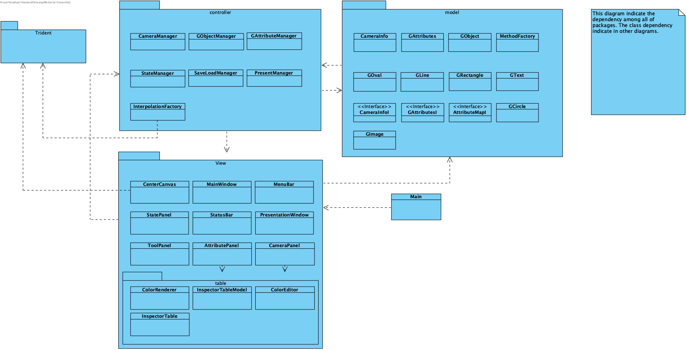
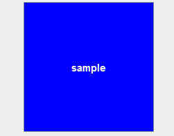
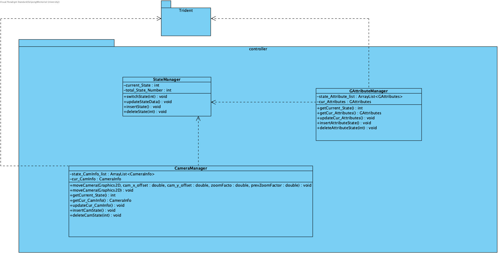
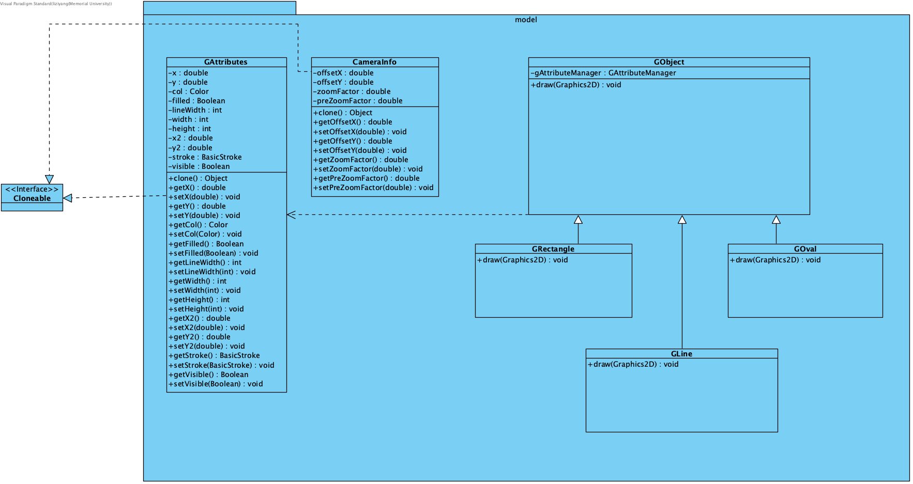
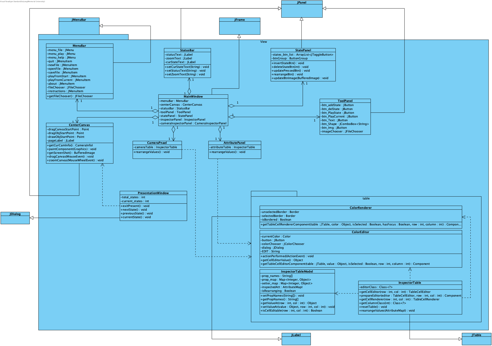
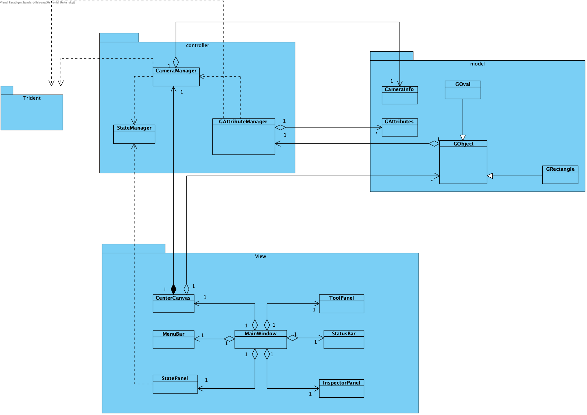

# High-level Design

## Table of Contents
  - [Packages UML](#packages-uml)
  - [Packages](#packages)
  - [Third Party Packages](#third-party-packages)
  - [Classes UML](#classes-uml)
  - [Classes Dependency based on Packages](#class-dependency-package)
  - [Classes Description](#classes-description)

## Packages UML
> 

## Packages
+ Model
    - Contains model classes for graphical objects, object attributes, camera information, etc.
+ View
    - Contains view classes that implement Swing GUI. 
+ Controller
    - Contains manager classes that manage interactions between the model and the view, affecting data such as states, attributes, camera, etc.

## Third Party Packages
+ Trident
    - Trident provides powerful and flexible animation APIs that scale from simple, single-property cases to complex scenarios that involve multiple animations.
    - Trident is part of [Radiance](https://github.com/kirill-grouchnikov/radiance).
    - Find Trident documentation [here](https://github.com/kirill-grouchnikov/radiance/blob/master/docs/trident/trident.md).
    - Our project uses Trident to build [timelines](https://github.com/kirill-grouchnikov/radiance/blob/master/docs/trident/TimelineLifecycle.md) and [interpolations](https://github.com/kirill-grouchnikov/radiance/blob/master/docs/trident/TimelineInterpolatingFields.md) for the camera and objects.
    - Trident examples:
      - | [Example 1](https://github.com/kirill-grouchnikov/radiance/blob/master/docs/trident/SimpleSwingExample.md) | [Example 2](https://github.com/kirill-grouchnikov/radiance/blob/master/docs/trident/ParallelSwingTimelines.md) |
        | :---------: | :---------: |
        |  |  |
          
     

## Classes UML
+ Controllor Package

+ Model Package 

+ View Package

## Classes Dependency based on Packages

## Classes Description
+ Model
  + | Class Name | Description |
    | :--------- | :---------- |
    | GObject | The base class for all graphical objects  | 
    | GAttributes | The base attribute class that holds all the attribute an object has |
    | CameraInfo | The base class for camera info that contains all |
    | GRectangle, GOval, GLine, etc. | The classes that implement corresponding graphics |

+ View
  + | Class Name | Description |
    | :--------- | :---------- |
    | MainWindow | This is the main GUI window that holds all the child GUI panels |
    | CenterCanvas | The center canvas where you can edit the presentation, move the camera, etc. |
    | InspectorPanel | The panel where you can check/edit attributes of the selected object, camera information, etc. |
    | MenuBar | Class used to display the application's menu bar |
    | StatePanel | The panel that shows all the state sequentially |
    | StatusBar | The bar at the bottom to show some info |
    | ToolPanel | The panel that contains different function buttons |

+ Controller
  + | Class Name | Description |
    | :--------- | :---------- |
    | StateManager | This is the class that controls all the state changes in Prezoom. |
    | GAttributeManager | This class is the manager to manage the state related functions for the attributes of graphical objects. Each GObject has a GAttributeManager. |
    | CameraManager | This class is the manager to manage all the camera related functions, including movement, info, states. |
