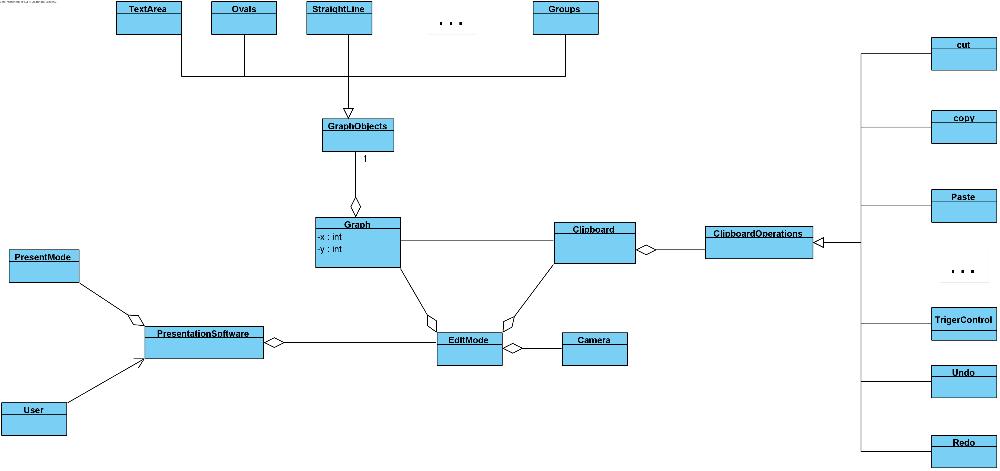

# Requirements Document

## Domain Model

## Lexicon

>User: The user of the presentation software.
PresentMode: In this mode, system begins with state 0. With the effect of trigger events, system can change to other states.
PresentationSoftware: The entity of the project.
Graph: Each graph has its own attributes which contains exact position (x, y). User could add, delete, move graphs.
GraphObjects: Each graph has different type, such as Text area, Ovals, Straight Line, Group.
TextArea: The graph object in which user can type text.
Ovals: The graph object with the shape of ovals.
StraightLine: A straight line graph object.
Groups: A combination of several graph objects.
EditMode: The mode user can modify the timeline, transition, and states in various way. 
Camera: A rectangular area which user can see with presentation mode
Clipboard: The interface has several operations
ClipboardOperations: User can use different operations with the software, such as cut, copy, paste, Trigger control, Undo, Redo. 
Cut: Cut operation.
Copy: Copy operation.
Paste: Paste operation.
TriggerControl: The operation which used to set the trigger.
Undo: Cancel or reverse the results of a previous action.
Redo: Operate the previous operation again.

## Requirements
>TODO